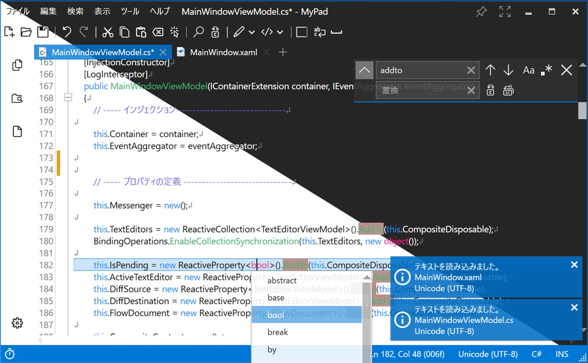
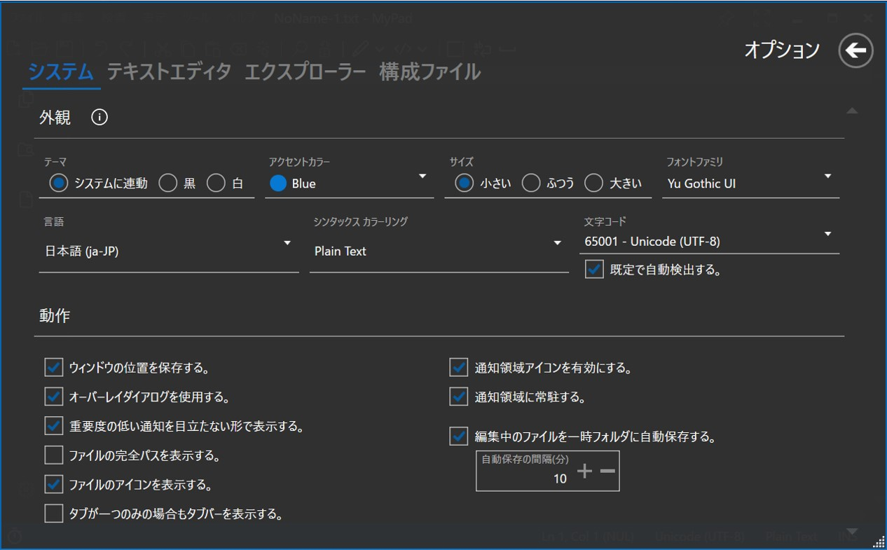

# MyPad

  
  
  

## 概要

MyPad は簡単操作ですぐに使えるシンプルなテキストエディタです。  
視認性に優れるモダンな外観に、使い慣れたクラシックな操作性を兼ね備え、様々な用途にご利用頂けます。

### 標準のメモ帳では足りないちょっとした機能

- 複数回使用可能な [元に戻す] [やり直し]
- 大小文字の区別や、正規表現による [検索] [置換]
- タブ切替による複数ファイルの表示と編集
- 行番号、空白、TAB、改行の可視化、折り返し表示
- 変更箇所の比較や差分検出

### 簡単なコーディングにも

- 文字コードとプログラミング言語の自動認識
- プログラミング言語別のカラー表示とキーワード補完
- ソースコードの折り畳み表示

### お好みにカスタマイズ

- テーマカラーや表示言語の変更
- テキストエディターの細かな動作を変更

## 開発情報

本プログラムは以下を主な基盤として採用し、構築されています。  

| 構成要素               | 採用項目               | Ver. (Minor) |
|------------------------|------------------------|--------------|
| UI プラットフォーム    | WPF                    | -            |
| フレームワーク         | .NET                   | 5.0          |
| プログラミング言語     | C#                     | 9.0          |
| MVVM / DI インフラ     | Prism.Unity            | 8.1          |
| デザインテンプレート   | MahApps.Metro          | 2.4          |
| エディタコンポーネント | ICSharpCode.AvalonEdit | 6.1          |
