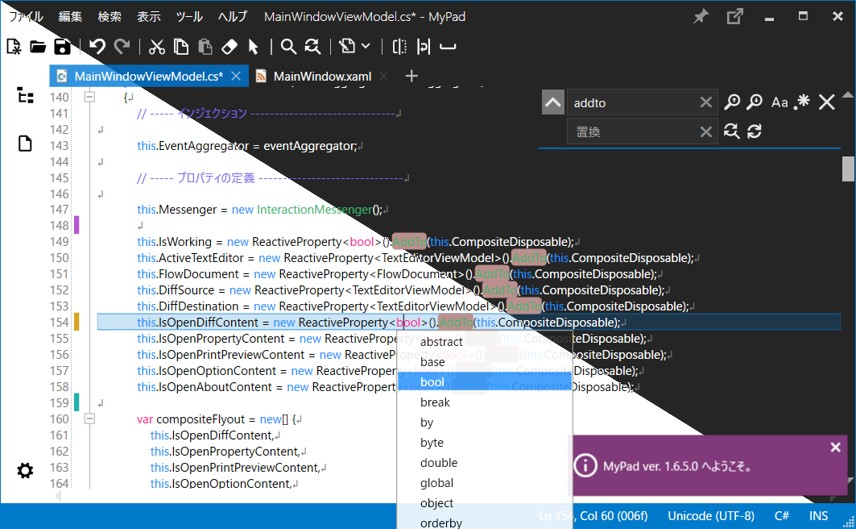

# MyPad (.NET Core)

  
  

## 概要

MyPad.NetCore は .NET Framework 製のメモ帳アプリケーション MyPad を、.NET Core の環境で再構築したプログラムです。  
現状は中核部分のみが実装されており、今後は残る機能の移植や新機能の追加を予定しています。  

### 標準のメモ帳では足りないちょっとした機能

- 複数回使用可能な [元に戻す] [やり直し]
- 大小文字の区別や、正規表現による [検索] [置換]
- タブ切替による複数ファイルの表示と編集
- 行番号、空白、TAB、改行の可視化、折り返し表示

### 簡単なコーディングにも

- 文字コードとプログラミング言語の自動認識
- プログラミング言語別のカラー表示とキーワード補完

## 開発情報

本プログラムは以下を主な基盤として採用し、構築されています。  

| 構成要素             | 採用項目                  | Ver.   |
|----------------------|---------------------------|--------|
| UI プラットフォーム  | WPF                       | -      |
| プログラミング言語   | C#                        | 8.0    |
| フレームワーク       | .NET Core                 | 3.1    |
| MVVM インフラ        | Prism                     | 7.2    |
| デザインテンプレート | MahApps.Metro             | 2.0   |
| コンポーネント       | ICSharpCode.AvalonEdit    | 6.0    |
